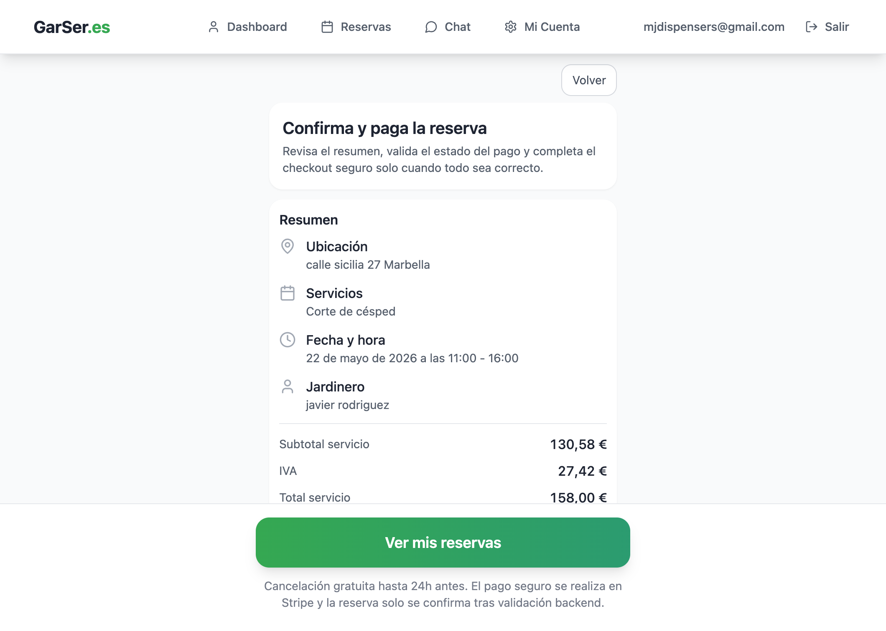
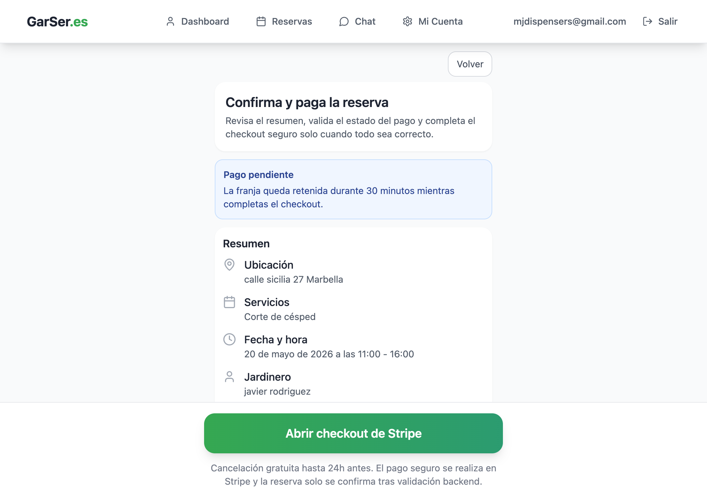

# Dogfood Report: GarSer Pagos Local

| Field | Value |
|-------|-------|
| **Date** | 2026-05-20 |
| **App URL** | http://localhost:5173/ |
| **Session** | payments-localhost-5173 |
| **Scope** | Flujo real de reserva y pago con Stripe en localhost usando datos de prueba y autenticacion de cliente |

## Summary

| Severity | Count |
|----------|-------|
| Critical | 0 |
| High | 0 |
| Medium | 0 |
| Low | 0 |
| **Total** | **0** |

## Verification

| Field | Value |
|-------|-------|
| **Final flow status** | Resuelto |
| **Paid attempt** | `ef337512-7ce1-4e20-971a-92e1a4fb2cae` |
| **Webhook event** | `evt_3TZIlT2MwFyGXuB71mllmtv7` |
| **Webhook ledger status** | `processed` |
| **Booking created** | `896d4a76-2d70-44af-ad01-5607911a8fa2` |
| **Evidence** | `screenshots/fixed-success-state.png` |

## Resolution Evidence

1. Navigate to http://localhost:5173/
2. Completa una reserva con dirección `calle sicilia 27 Marbella`, servicio `Corte de césped`, usando `Datos de prueba`.
3. Selecciona el jardinero `javier rodriguez`, fecha `22 de mayo de 2026` y tramo `11:00 - 16:00`.
4. Completa Stripe Checkout con tarjeta `4242 4242 4242 4242`, expiración `12/34`, CVC `123`.
5. **Observe:** el retorno muestra `Pago validado y reserva creada`, la BD deja el intento en `booking_created`, el webhook queda en `processed` y `booking_blocks` contiene los bloques 11-15.

## Resolved Issue History

<!-- Copy this block for each issue found. Interactive issues need video + step-by-step screenshots. Static issues (typos, visual glitches) only need a single screenshot -- set Repro Video to N/A. -->

### ISSUE-001: El pago se cobra en Stripe pero la reserva no se consolida al volver

| Field | Value |
|-------|-------|
| **Severity** | high |
| **Category** | functional |
| **Status** | resolved |
| **URL** | http://localhost:5173/reserva/confirmacion?checkout=success&attempt_id=31fe86fa-2588-41a4-8bb6-d8385fc63f10&session_id=cs_test_a1HI70vv1Gt7atF30GHmdfh9ugKB8mKE7jwkvmlAT86VWW1NgExxFSYFLZ |
| **Repro Video** | N/A |

**Description**

Stripe aceptaba el cobro de prueba y redirigía correctamente al flujo de confirmación, pero la app no creaba la reserva. La pantalla entraba en "Comprobando pago…", registraba `booking_payment_failed` y volvía al estado `Abrir checkout de Stripe` aunque el intento ya figuraba pagado en Stripe.

**Resolution**

Se desplegaron las remediaciones de observabilidad, determinismo e idempotencia; se restauró la tabla `public.booking_blocks`; y se revalidó el flujo real. El estado final ya es `booking_created`, el webhook queda `processed` y la UI muestra la reserva confirmada.

**Repro Steps**

1. Navigate to http://localhost:5173/
2. Completa una reserva con dirección `calle sicilia 27 Marbella`, servicio `Corte de césped`, usando `Datos de prueba`, y selecciona un slot para `javier rodriguez`.
3. Baja al final del checkout, inicia sesión con `mjdispensers@gmail.com` y completa el pago en Stripe con tarjeta de prueba.
4. **Observe:** el retorno cae en confirmación, no crea la reserva y deja de nuevo el CTA de Stripe.
   

---
